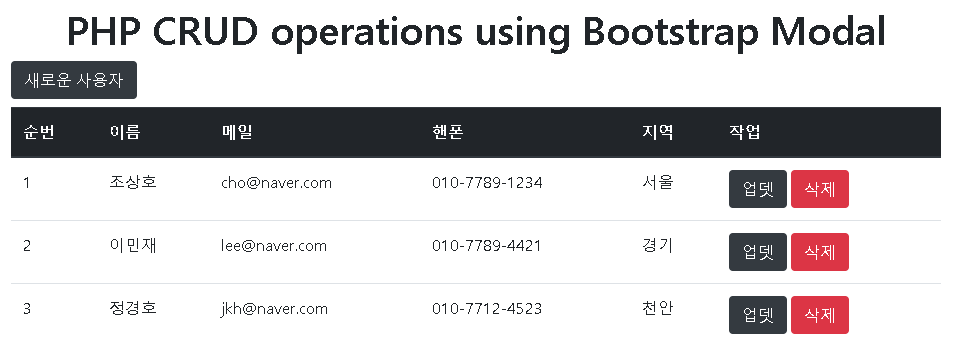

## PHP CRUD using Bootstrap Modal || Complete Project || AJAX || JQUERY

1. <https://www.youtube.com/watch?v=1R9iHaZoE2>

2. <https://youtu.be/A9xIZA2g0g8>

3. 

### 코드 사용법

1. GIT CLONE 또는 ZIP 파일 다운로드 (xampp 프로그램이 설치되어 있다면 xampp 폴더 안의 htdocs 내부에 설치)

2. phpmyadmin에서 sql 폴더 안의 bootstrap_crud.sql 파일 가져오기 실행(데이터베이스 생성)

3. XAMPP 실행 후 Apache, MySQL Start

4. Chrome 브라우저 실행 후 주소 표시줄에 http://localhost/ajax_crud 입력
